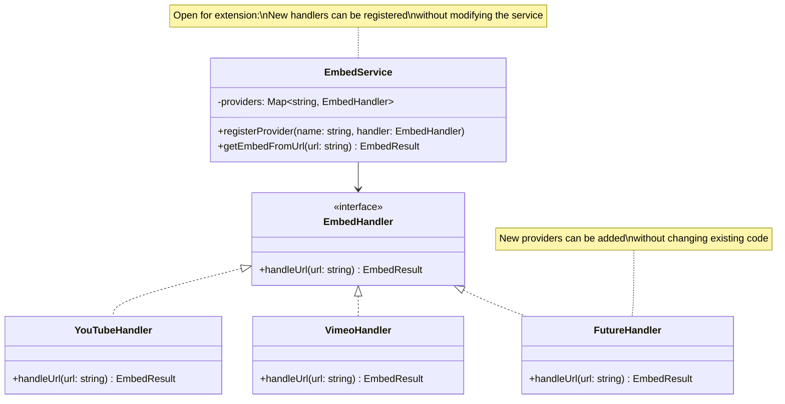

```mermaid
classDiagram
    class EmbedHandler {
        <<interface>>
        +handleUrl(url: string) EmbedResult
    }
    
    class YouTubeHandler {
        +handleUrl(url: string) EmbedResult
    }
    
    class VimeoHandler {
        +handleUrl(url: string) EmbedResult
    }
    
    class FutureHandler {
        +handleUrl(url: string) EmbedResult
    }
    
    class EmbedService {
        -providers: Map~string, EmbedHandler~
        +registerProvider(name: string, handler: EmbedHandler)
        +getEmbedFromUrl(url: string) EmbedResult
    }
    
    EmbedHandler <|.. YouTubeHandler
    EmbedHandler <|.. VimeoHandler
    EmbedHandler <|.. FutureHandler
    
    EmbedService --> EmbedHandler
    
    note for EmbedService "Open for extension:\nNew handlers can be registered\nwithout modifying the service"
    note for FutureHandler "New providers can be added\nwithout changing existing code"
```