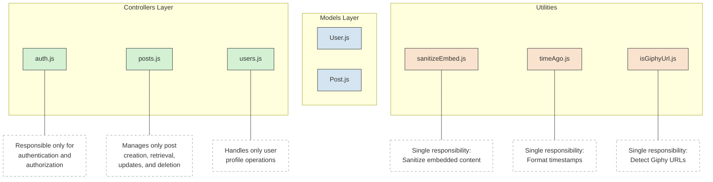

```mermaid
graph TD
    subgraph "Controllers Layer"
        AuthController["auth.js"]
        PostsController["posts.js"]
        UsersController["users.js"]
    end
    
    subgraph "Models Layer"
        UserModel["User.js"]
        PostModel["Post.js"]
    end
    
    subgraph "Utilities"
        SanitizeUtil["sanitizeEmbed.js"]
        TimeAgoUtil["timeAgo.js"]
        GiphyUtil["isGiphyUrl.js"]
    end
    
    %% Notes
    AuthController --- AuthNote["Responsible only for<br/>authentication and<br/>authorization"]
    PostsController --- PostsNote["Manages only post<br/>creation, retrieval,<br/>updates, and deletion"]
    UsersController --- UsersNote["Handles only user<br/>profile operations"]
    
    SanitizeUtil --- SanitizeNote["Single responsibility:<br/>Sanitize embedded content"]
    TimeAgoUtil --- TimeNote["Single responsibility:<br/>Format timestamps"]
    GiphyUtil --- GiphyNote["Single responsibility:<br/>Detect Giphy URLs"]
    
    classDef controller fill:#d4f1d4,stroke:#333
    classDef model fill:#d4e5f1,stroke:#333
    classDef util fill:#f9e3ce,stroke:#333
    classDef note fill:#fff,stroke:#999,stroke-dasharray: 5 5
    
    class AuthController,PostsController,UsersController controller
    class UserModel,PostModel model
    class SanitizeUtil,TimeAgoUtil,GiphyUtil util
    class AuthNote,PostsNote,UsersNote,SanitizeNote,TimeNote,GiphyNote note
```